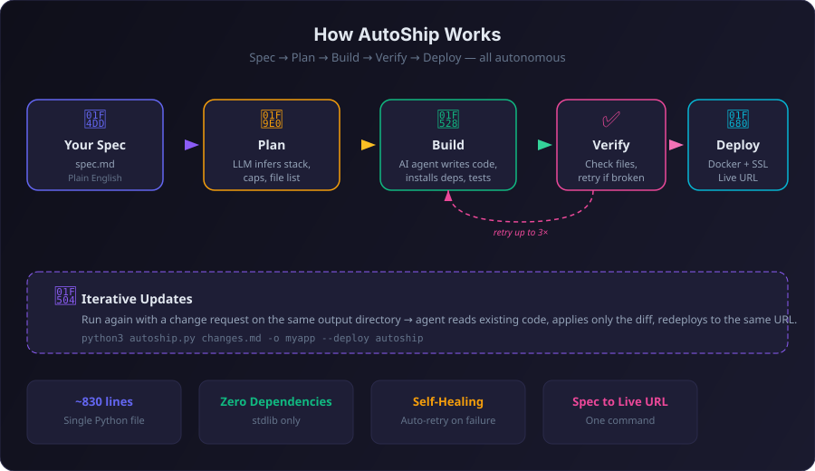

<div align="center">

# 🚀 AutoShip

### Describe it. Ship it.

**Plain English spec. Capability-aware build. Live deployed app.**

[](https://opensource.org/licenses/MIT)
[](https://www.python.org/)
[](#)
[](#)
[](#)
[](#)

<br/>



<br/>
<br/>

*Write a spec in markdown. Get a working, deployed app with a URL. Update it by describing what to change.*

</div>

---

## ⚡ What is AutoShip?

AutoShip is an autonomous app builder. You write a plain English spec, and it:

1. **Plans** — picks the simplest stack, infers capabilities (auth, database, storage, etc.)
2. **Builds** — spawns an AI agent that writes every file, installs deps, and tests locally
3. **Verifies** — checks the build, retries up to 3x if something is broken
4. **Deploys** — Dockerizes, deploys, configures SSL → hands you a live URL
5. **Updates** — run again with a change request, same URL, only the diff applied

The core engine is still a single small Python CLI with zero third-party Python dependencies.

## 🤔 Why AutoShip?

| | AutoShip | Vercel/Netlify | ChatGPT Artifacts | Replit |
|---|---|---|---|---|
| **Input** | Plain English spec | Git repo + framework | Chat prompt | Chat prompt |
| **Output** | Live deployed app | Hosted static/app | Sandbox preview | Cloud workspace |
| **Infra needed** | None | Git + framework config | None | None |
| **Iterative updates** | ✅ Same URL | Push + redeploy | Re-prompt | Re-prompt |
| **Self-healing** | ✅ Auto-retry | ❌ | ❌ | ❌ |
| **Owns your code** | ✅ Local files | ✅ Git repo | ❌ Locked in | ⚠️ Cloud only |
| **Vendor lock-in** | None | Platform-tied | Platform-tied | Platform-tied |
| **Deploys anywhere** | ✅ Any server | Their platform | No deploy | Their platform |

**AutoShip is for people who have an idea and want it live in minutes, not hours.**

## 📦 Installation

```bash
# Clone the repo
git clone https://github.com/ranausmanai/autoship.git
cd autoship

# That's it. No pip install. No setup. Just Python 3.10+
```

### Prerequisites

You need one of these AI backends installed:

- **[Claude Code CLI](https://docs.anthropic.com/en/docs/claude-code)** — `claude` command
- **[Codex CLI](https://github.com/openai/codex)** — `codex` command

## 🏁 Quick Start

### 1. Try the included example

The repo ships with `example.md` — a sample spec for a habit tracker app. Try it immediately:

```bash
python3 autoship.py example.md
```

Or write your own spec — any markdown file describing what you want:

```markdown
# Spec: Budget Tracker

A simple web app to track daily expenses.

## Features
- Add expenses with amount, category, and date
- See a pie chart breakdown by category
- Monthly totals and daily average
- Data persists in localStorage

## Design
- Clean, minimal UI
- Mobile-friendly
```

```bash
python3 autoship.py my-spec.md
```

### 2. Watch it work

```
============================================================
  autoship — describe it, ship it
============================================================
  spec:    example.md
  engine:  claude
  output:  ship_example/
  deploy:  none
============================================================

  [1/2] Planning... static_site / vanilla html/css/js
           caps: db=none, auth=none, payments=none, email=none
           turnkey: yes

  [2/2] Building... done

============================================================
  SHIPPED -> ship_example/
============================================================
```

Your app is in `ship_example/`. Open `index.html` or run the start command.

## 🔄 Iterative Updates

Already built an app? Write a change request and point to the same output:

```bash
# First build
python3 autoship.py spec.md -o myapp

# Later — update the same app
echo "Add a weekly summary chart showing completion rates over time" > change.md
python3 autoship.py change.md -o myapp
```

AutoShip detects the existing build, reads all current files, and applies **only the changes**. No full rebuild. Same URL if deployed.

```
============================================================
  autoship — updating existing app
============================================================
  change:  change.md
  files:   5 existing

  [1/2] Applying changes... done

============================================================
  UPDATED -> myapp/
============================================================
```

## 🌐 Deploy to a Live URL

### Hosted deploy on autoship.fun

The smallest public flow is one command:

```bash
python3 autoship.py spec.md --deploy autoship --slug my-app
```

If the hosted server is running in public beta mode, that is enough.

If the hosted server is running in invite-only mode, the fallback is:

```bash
# Login once with an invite code
python3 autoship.py login --code SHIP-ABC123

# Then deploy normally
python3 autoship.py spec.md --deploy autoship --slug my-app
```

Invite-only login stores your deploy token locally at `~/.config/autoship/auth.json`.

### Deploy to your own server

```bash
# Operator/self-host path
python3 autoship.py spec.md --deploy autoship \
  --server root@your-server.com \
  --domain yourdomain.com \
  --slug my-app \
  --ssh-key ~/.ssh/my_key
```

The self-host path does: tarball -> SCP -> Docker build -> container start -> Nginx proxy -> SSL cert.

```
  [1/3] Planning... web_app / flask
  [2/3] Building... done
  [3/3] Deploying... https://my-app.yourdomain.com

============================================================
  SHIPPED -> ship_spec/
============================================================
  LIVE URL:   https://my-app.yourdomain.com
  CERT STATE: requested
```

Update it later → same URL, zero downtime:

```bash
python3 autoship.py changes.md -o ship_spec --deploy autoship --slug my-app
```

## 🧠 Smart Capability Inference

AutoShip reads your spec and automatically figures out what your app needs:

| Spec mentions | AutoShip infers | What it does |
|---|---|---|
| "login", "signup", "account" | `auth: local` | Adds auth with SQLite sessions |
| "OAuth", "Google login" | `auth: external` | Flags external secrets needed |
| "save", "persist", "history" | `database: sqlite` | Sets up SQLite at `/data/app.db` |
| "upload", "images" | `storage: local` | File storage under `/data/uploads` |
| "stripe", "payment" | `payments: external` | Flags Stripe keys needed |
| "admin", "moderation" | `admin: true` | Includes admin panel |
| "API", "webhook" | `api: true` | Exposes API endpoints |

If it detects auth → it auto-adds a database. If it detects payments → it ensures a database exists. Smart defaults, no config needed.

## 🛡️ Self-Healing Builds

Builds don't always work on the first try. AutoShip handles it:

1. Agent builds the app
2. AutoShip **verifies** all planned files were created
3. If files are missing or the agent crashed → **automatic retry** with a targeted fix prompt
4. Up to **3 attempts** before giving up
5. Progress shows exactly what's happening:

```
  [2/3] Building...
  [2/3] retrying (1/3)... done
```

## 🧩 How It Works Under the Hood

AutoShip is a **prompt compiler**. It doesn't write code — it assembles precise prompts and hands them to an AI agent with file system access.

```
spec.md
  ↓
┌─────────────────────────────┐
│  1. PLAN                    │  LLM reads spec → returns JSON
│     app_type, stack, files  │  (capabilities auto-inferred)
│     capabilities, secrets   │
└─────────────┬───────────────┘
              ↓
┌─────────────────────────────┐
│  2. BUILD                   │  LLM agent with file access
│     program.md + spec +     │  writes code, installs deps,
│     plan + contracts        │  runs app, fixes errors
└─────────────┬───────────────┘
              ↓
┌─────────────────────────────┐
│  3. VERIFY + RETRY          │  Check files exist
│     up to 3 attempts        │  Retry with fix prompt if not
└─────────────┬───────────────┘
              ↓
┌─────────────────────────────┐
│  4. DEPLOY (optional)       │  Tarball → Docker → Nginx
│     SSL + live URL          │  → SSL cert → live URL
└─────────────────────────────┘
```

The magic is in the **capability contracts** — structured constraints that tell the agent exactly what to build and what NOT to build, preventing scope creep and unnecessary complexity.

## ⚙️ CLI Reference

```
python3 autoship.py <spec> [options]

Arguments:
  spec                    Path to spec or change-request file (.md or .txt)

Options:
  -o, --output DIR        Output directory (default: ship_<spec_name>)
  -e, --engine ENGINE     LLM backend: claude or codex (default: claude)
  --deploy TARGET         Deploy target: none or autoship (default: none)
  --slug SLUG             Subdomain slug for deployment
  --server HOST           SSH target for self-hosted deploy (or AUTOSHIP_SERVER)
  --domain DOMAIN         Base domain (or AUTOSHIP_DOMAIN, default: autoship.fun)
  --ssh-key PATH          SSH key path (or AUTOSHIP_SSH_KEY)
  --email EMAIL           Let's Encrypt email (or AUTOSHIP_EMAIL)
  --api-url URL           Hosted deploy API URL (or AUTOSHIP_API_URL)
  --api-token TOKEN       Hosted deploy API token (or AUTOSHIP_API_TOKEN)
```

### Login commands

```bash
python3 autoship.py login --code SHIP-ABC123
python3 autoship.py logout
```

## 🎯 Use Cases

**🏗️ Instant Prototyping**
Have an idea? Write 10 lines of spec, get a working prototype in minutes. Perfect for validating concepts before investing engineering time.

**🛠️ Internal Tools**
"I need a dashboard that shows our deployment stats." Write it in plain English, get a working internal tool. No Retool subscription needed.

**🎓 Learning & Hackathons**
Students and hackers: go from idea to deployed demo faster than anyone else at the table.

**📋 Client Prototypes**
Freelancers: show clients a working prototype before writing a single line of code yourself. Iterate based on their feedback instantly.

**🧪 Throwaway Apps**
Need a quick form, a survey tool, a landing page? AutoShip it, use it, move on. The app is disposable, the URL is real.

## 📁 Project Structure

```
autoship/
├── autoship.py              # Main CLI: plan, build, retry, update, deploy
├── deploy_release.sh        # Shared release deploy script
├── hosted_api/              # Private autoship.fun service example
│   ├── server.py
│   ├── issue_invite.py
│   └── autoship-api.service
├── site/                    # Static autoship.fun landing page
│   ├── index.html
│   ├── styles.css
│   ├── favicon.svg
│   └── og-card.svg
├── program.md               # Agent instructions
├── example.md               # Sample spec
└── README.md
```

The OSS split is:

- `autoship.py` is the public client.
- `hosted_api/` is the private-service reference implementation.
- `site/` is the root landing page for `autoship.fun`.

Secrets, tokens, and VPS env files stay out of the repo.

## 🤝 Contributing

AutoShip follows a **Karpathy-minimal** philosophy: short code, markdown config, autonomous operation. Contributions should keep it that way.

1. Fork the repo
2. Make your changes
3. Keep it simple — if it adds complexity, it needs to justify its existence
4. Submit a PR

## 📄 License

MIT — do whatever you want with it.

---

<div align="center">

**AutoShip** — *describe it, ship it* 🚀

</div>
